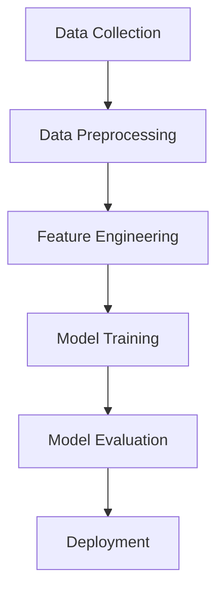

# Music Genre Prediction

## Project Description
This project aims to develop a machine learning model capable of predicting the music genre based on numerical features of songs. By analyzing both acoustic properties and lyrical data, the model will help classify songs into their respective genres, providing valuable insights into music data.

## Problem Statement
In an era of growing digital music libraries, organizing and categorizing songs by genre has become crucial for better user experience. Manual classification of genres is labor-intensive and prone to errors. This project addresses the need for an automated solution to predict the genre of a song based on its numerical and textual features, making it easier to manage large music datasets efficiently.

## Data Source
The dataset used for this project is a comprehensive collection of songs with the following characteristics:
- **Size:** 28,372 records
- **Attributes:** 31 features, including:
  - Song details: artist name, track name, release year, genre (target variable)
  - Acoustic features: danceability, loudness, energy, valence, instrumentalness, and more
  - Lyrics analysis: features capturing emotions and themes, such as sadness, romanticism, and violence

### Justification for Data Choice
This dataset provides a rich variety of numerical features that are highly relevant for building machine learning models. The inclusion of lyrical analysis and acoustic properties ensures a multi-faceted approach to genre prediction, making the dataset ideal for this task.

## Project Goals
1. **Data Processing and Analysis:**
   - Explore the dataset to understand its structure and properties.
   - Clean and preprocess data to handle missing values and outliers.
2. **Model Development:**
   - Build and train a machine learning model to predict the genre of a song.
   - Evaluate model performance using appropriate metrics (e.g., accuracy, precision, recall).
3. **Model Optimization and Testing:**
   - Fine-tune the model to improve its accuracy.
   - Test the model on unseen data to ensure generalization.
4. **Deployment:**
   - Package the model for deployment in a user-friendly application or API.

## Workflow Overview
1. **Data Collection and Exploration:**
   - Load the dataset and explore key features.
2. **Data Preprocessing:**
   - Normalize and scale numerical features.
   - Encode categorical variables (e.g., genre).
3. **Model Training and Validation:**
   - Train multiple algorithms (e.g., Random Forest, Neural Networks) and compare results.
4. **Model Deployment:**
   - Develop an API or integrate the model into a web application.

## Diagram

---

## Requirements
- **Programming Language:** Python
- **Libraries:** pandas, scikit-learn, TensorFlow/PyTorch, matplotlib, seaborn
- **Environment:** Anaconda or virtualenv

## Expected Outcome
By the end of this project, we aim to deliver:
1. A trained and validated machine learning model capable of predicting music genres.
2. A documented analysis of the dataset and model performance.
3. A deployable version of the model (e.g., Flask API or web app).

## Data Analysis and Observations

This section summarizes the findings and insights gained from the automated data analysis report.

### **Dataset Overview**
- **Number of variables:** 26
- **Number of observations:** 19,860
- **Missing values:** None (0%)
- **Duplicate rows:** None (0%)
- **Dataset size in memory:** 4.1 MiB

### **Alerts and Highlights**
1. **High Correlations:**
   - `acousticness` is highly correlated with `energy` and `loudness`.
   - `release_date` is highly correlated with `loudness`.
   - `topic` is highly correlated with `world/life`.

2. **Variables with Zero Values:**
   - `genre`: 16.3% of the values are zeros.
   - `instrumentalness`: 27.7% of the values are zeros.
   - `topic`: 2.2% of the values are zeros.

### **Correlation Matrix Insights**
- The dataset contains several highly correlated variables, which may indicate redundancy:
  - For example, `acousticness`, `energy`, and `loudness` show significant correlations.
  - Similarly, `topic` and `world/life` exhibit high correlation.

### **Missing Values**
- There are no missing values in the dataset, eliminating the need for imputation.

### **Recommendations**
1. **Feature Reduction:**
   - Remove or aggregate highly correlated variables such as `acousticness`, `energy`, and `loudness` to avoid redundancy.
   - Consider combining `topic` and `world/life` into a single variable.

2. **Handling Zero Values:**
   - Analyze the impact of `instrumentalness` (27.7% zeros) and determine if it is necessary for the model.
   - Investigate zero values in `genre` and `topic` to assess their significance.

3. **Dimensionality Reduction:**
   - Apply techniques like PCA to reduce the dimensionality of the dataset if needed.

4. **Model Selection:**
   - Models like **Random Forest** and **Gradient Boosting** can handle the dataset's characteristics effectively.
   - For reduced dimensions, linear models might be explored.

## Recommended Models
### 1. GaussianNB (Naive Bayes)
**Description:**
Gaussian Naive Bayes is a probabilistic classifier that assumes the features follow a normal distribution. It is simple, efficient, and works well with small datasets. However, it is less effective when dealing with complex feature interactions.

**Details:**
- Generation: 0
- Mutation count: 0
- Crossover count: 0
- Internal cross-validation score: 0.3410

**Pros:**
- Fast and lightweight
- Works well with smaller datasets
- Good for problems with normally distributed features

**Cons:**
- Assumes independence of features, which may not hold in real-world scenarios
- Lower accuracy compared to more complex models

### 2. RandomForestClassifier
**Description:**
Random Forest is an ensemble learning method that constructs multiple decision trees and combines their predictions. It is robust, handles missing values well, and is less prone to overfitting.

**Details:**
- Generation: 0
- Mutation count: 0
- Crossover count: 0
- Internal cross-validation score: 0.4449

**Pros:**
- High accuracy
- Handles both numerical and categorical data
- Reduces overfitting by averaging multiple decision trees

**Cons:**
- Slower compared to simpler models
- Requires more memory and computational power

### 3. XGBClassifier (Extreme Gradient Boosting)
**Description:**
XGBoost is a powerful gradient boosting framework optimized for speed and performance. It builds multiple weak models sequentially and corrects their errors iteratively.

**Details:**
- Generation: 0
- Mutation count: 0
- Crossover count: 0
- Internal cross-validation score: -inf (Indicating poor performance or convergence issues)

**Pros:**
- Highly accurate
- Efficient with large datasets
- Handles missing values well

**Cons:**
- Computationally expensive
- Requires careful hyperparameter tuning

## Chosen Model for Further Development
The **RandomForestClassifier** has been selected for further development due to its balance between accuracy, interpretability, and robustness. It outperforms GaussianNB in terms of accuracy and is more stable than XGBoost, which showed convergence issues in this case. Random Forest’s ability to handle diverse feature sets makes it well-suited for music genre classification.

# Music Genre Prediction - Model Evaluation

## Model Performance Summary

### Overall Accuracy  
The trained model achieved an accuracy of **45.55%** on the validation dataset.

---

## Classification Report  

Below is a detailed breakdown of the model's performance across different genres:

| Genre     | Precision | Recall | F1-Score | Support |
|-----------|-----------|--------|----------|---------|
| **Blues**    | 0.41      | 0.29   | 0.34     | 971     |
| **Country**  | 0.45      | 0.57   | 0.50     | 1135    |
| **Hip Hop**  | 0.73      | 0.41   | 0.53     | 188     |
| **Jazz**     | 0.50      | 0.41   | 0.45     | 817     |
| **Pop**      | 0.42      | 0.56   | 0.48     | 1482    |
| **Reggae**   | 0.50      | 0.44   | 0.47     | 518     |
| **Rock**     | 0.50      | 0.36   | 0.42     | 847     |

---

### Aggregate Metrics  

- **Accuracy:** **45.55%**  
- **Macro Average:** Precision = **50%**, Recall = **44%**, F1-Score = **46%**  
- **Weighted Average:** Precision = **46%**, Recall = **46%**, F1-Score = **45%**  

---

## Confusion Matrix  

Below is the confusion matrix visualization of the model's predictions:

---

## **Analysis & Observations**  

### **Class Imbalance Issues:**  
- Some genres (e.g., **Hip Hop**) have a **higher precision (0.73) but lower recall (0.41)**, meaning that while it correctly identifies positive cases, it struggles to detect all relevant samples.  
- **Country (0.57 recall) and Pop (0.56 recall)** have relatively better recall, meaning the model detects more of their instances correctly.

### **Performance Improvement Areas:**  
- **Increase Recall for Blues & Rock:** These genres have relatively low recall, meaning the model misses many actual instances.  
- **Fine-tune Hyperparameters:** Adjust `n_estimators`, `max_depth`, and `learning_rate` to improve predictive performance.  
- **Feature Engineering:** Explore additional transformations to improve separation between genres.  
- **Balance the Dataset:** Apply **oversampling (e.g., SMOTE)** or **undersampling** to ensure even representation across genres.

---

## **Next Steps**  
**Implement Hyperparameter Tuning** using **GridSearchCV** or **RandomizedSearchCV**  
**Try Alternative Models** such as **XGBoost** or **LightGBM**  
**Optimize the Classification Threshold** to improve recall and precision balance  
**Deploy the Model** and monitor real-world performance to refine further  

This document serves as the **model evaluation summary** for the **Music Genre Prediction** project. Further improvements will be iteratively applied based on performance feedback. 
